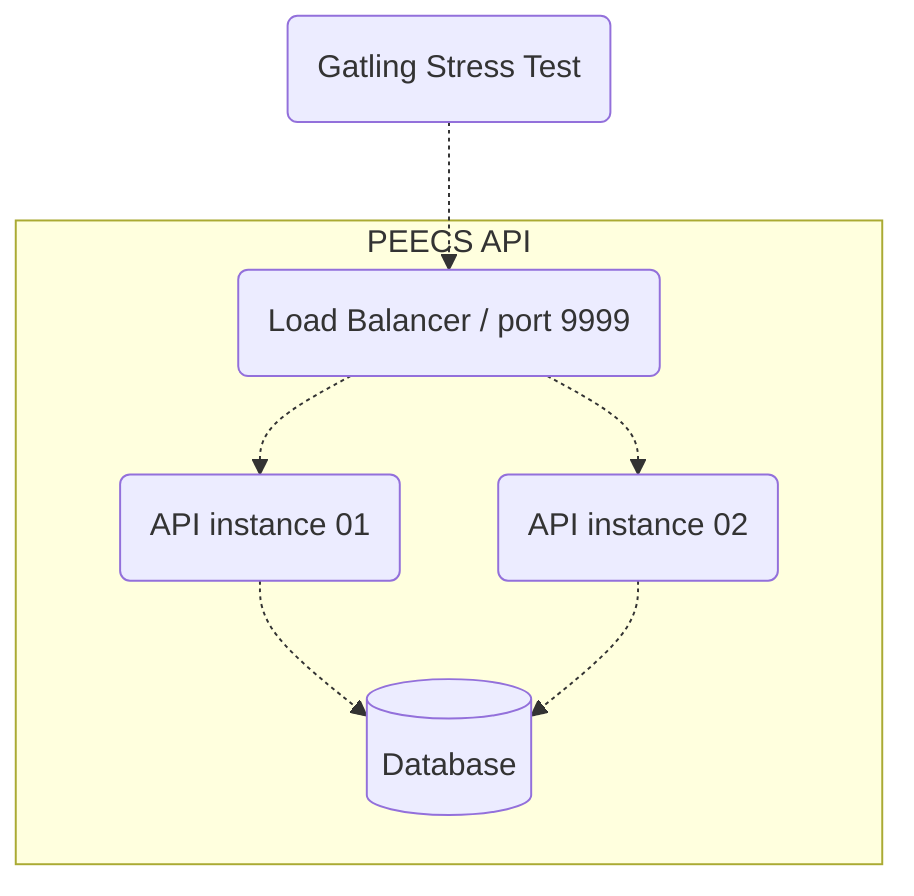
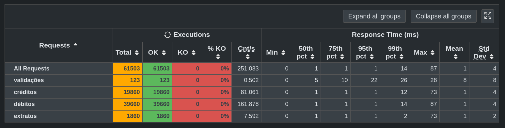

# Our country is in danger...

There is no better way to put it. I'm sorry. We all face this terrible situation, and I'm glad that you came to help. I'm confident that together we might fix this and make it through. It seems you are new here, so allow me to explain a little bit more...


When we decided to centralize *all* financial transactions in a single system, the PEECS, it was supposed to bring us a new era in commerce. And we were confident that modern cloud computing would solve any performance issues that might come up. With secure and centralized control, every purchase would be faster and safer. That part was true. With so much prosperity, transactional volume blew beyond our wildest imagination. Buffers started to fill. Queues got longer. Some transactions even failed, something unheard in decades.

Now, the PEECS is at the brink of collapse. We estimate that, in only a few hours, we'll be over capacity in all systems. The final gridlock may be inevitable. However, if we can improve the latency of the system, even in only a single digit of a percentage in the 99 percentile, we might just as well deploy and recover in time.  

In this repository you will find everything you need. Not only the PEECS code, containers and data; but also several variations and experiments from the ones that came before you, usually indicated in the file names. 

The system interface is very simple, taking HTTP requests and returning json data. Here's a sample transaction with the minimal information required (person id, value, type and description).

```
POST /members/[id]/transactions

{
    "amount": 1000,
    "kind" : "c",
    "description" : "description"
}

```

Here's a sample balance request. You can use it to test the system in development mode with ```curl localhost:9000/members/1/balance``` :
```
GET /members/[id]/balance

{
  "current_balance": {
    "total": -9098,
    "date_balance": "2024-01-17T02:34:41.217753Z",
    "limit": 100000
  },
  "recent_transactions": [
    {
      "amount": 10,
      "kind": "c",
      "description": "description",
      "submitted_at": "2024-01-17T02:34:38.543030Z"
    },
    {
      "amount": 90000,
      "kind": "d",
      "description": "description",
      "submitted_at": "2024-01-17T02:34:38.543030Z"
    }
  ]
}
```

Please don't worry about other transaction types for now. The volume of these two transactions are an order of magnitude larger than all others combined. If we can fix them, our job here is done. 

To avoid unnecessary expenses, we are using a constrained hardware model. Your code MUST run in two API instances and be constrained in resources for the entire test execution. You'll have 1.5 CPU units and 550MB of memory. If we can make it in the constrained environment, we are ensured that it will work in with the infrastructure resources in production. Here's a diagram of the reference architecture:




Some important files in this repository:
* ```docker-compose.yml``` these are the services that will be started and tested. Make sure your container images are built and configured correctly.
* ```peecs/``` link to the source of the best performing application code.
* ```init.sql``` link to the source of the best performing database code.
* ```alternatives/``` other configuration attempts.
* ```perf-test/load-test/user-files/``` performance test results.
* ```rinha-de-backend-2024-q1``` Test suit and configurations from others, for insipration.

*Work starts Here!* 
You can use a [cloud development environment](https://gitpod.io/new/?autostart=false#https://github.com/faermanj/quarkus-performance-workshop) with all tools ready to go and running or [setup your own machine](./.gitpod.Dockerfile), as you prefer. I'd recommend the CDE, so you don't waste any time. Also, the CDE runs all tests automatically on initialization.

*#protip: You can run multiple cloud develpment environments in parallel to test multiple scenarios at the same time.*

Once tests are finished, you can verify the latency percentiles in the [Gatling](https://gatling.io) report on the ```results/``` directory. Simply open the ```index.html``` file using LiveServer or download your resultswip.



*When you have any improvements to share, do not hesitate to send a Pull Request.*

Good luck and may fortune bless us all.

*Huge thanks to [Zan Franceschi](https://github.com/zanfranceschi) and everybody that joined [Rinha de Backend](https://github.com/zanfranceschi/rinha-de-backend-2024-q1), from where this content was inspired.*

Thank you all here at Devoxx, *please* submit your feedback at https://devoxx.be/talk/squeezing-performance-out-of-quarkus/

# A few things to try

* Execute the gatling performance tests (```perf-test/run-local-test.sh```) and evaluate the results report.
* Change settings for the load balancer (```nginx.conf```), application (```docker-compose.yml```) and database (```postgresql.conf```).
* Review the application code (```./peecs/src/main/java```).
* Change the version (```version.txt```), rebuild and push the container image for the application. Check the ```.envrc-sample``` file for registry credentials.
* Update to the latest Java release
* Change garbage-collection algorithm and parameters
* Improve application warmup (cold-start)
* Build a native image
* Is reacive really faster?
* Use profile-guided optimization (PGO), an initial profile is provided in the file ```profile.iprof```
* Try single-binary native images (musl)
* Add telemetry / profiling 


# References

* [Quarkus Documentation](https://quarkus.io/guides/)
* [Quarkus Settings](https://quarkus.io/guides/all-config)
* [Building Native Images](https://quarkus.io/guides/building-native-image)
* [Postgresql Tuner](https://pgtune.leopard.in.ua/)
* [Postgres Functions](https://www.tutorialspoint.com/postgresql/postgresql_functions.htm)
* [GraalVM Memory Management](https://www.graalvm.org/latest/reference-manual/native-image/optimizations-and-performance/MemoryManagement/)
* [GraalVM Profile Guided Optimization](https://www.graalvm.org/22.0/reference-manual/native-image/PGO/)
* [NGINX Performance Tuning](https://github.com/denji/nginx-tuning)
* [Vlad Mihalcea on Performance Tuning](https://vladmihalcea.com/tag/performance-tuning/)

